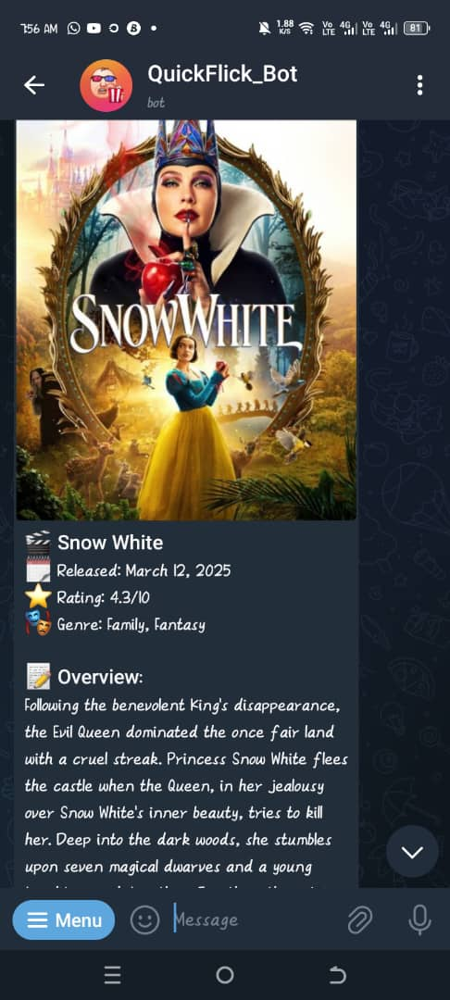
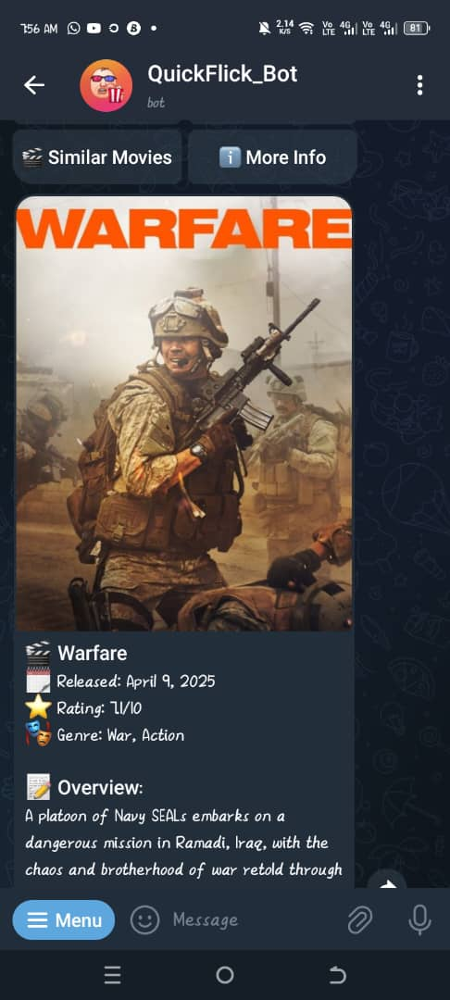
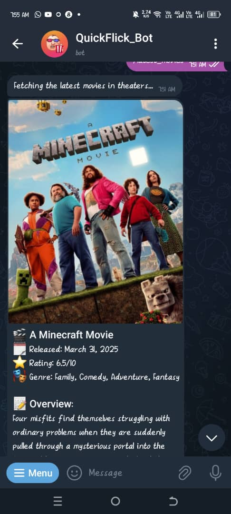

# 🎬 QuickFlick Bot: Your Cinematic Sidekick 🍿

**Status: 🚧 STILL COOKIN' IN THE DEVELOPMENT KITCHEN! 🚧**

A sassy little Telegram bot that keeps you in the loop on all things movies and TV series, powered by the mighty TMDB database.

## ✨ What This Bad Boy Can Do

- 🆕 Slide fresh-from-the-oven movies straight into your Telegram chat
- 🖼️ Flash those gorgeous movie posters with all the juicy details:
  - When it dropped 📅
  - How awesome people think it is ⭐
  - What flavor of movie you're dealing with 🏷️
  - The "what's it all about" scoop 📝
- 👇 Tap-happy buttons for:
  - 📽️ Trailer viewing (for when reading is too much work)
  - 👨‍👩‍👧‍👦 Celebrity stalking (ahem, we mean "cast information")
  - 🤔 "If you liked that, you might like this" magic
  - 🔍 The deep dive for movie nerds
- 📄 Flip through movies like you're browsing Tinder (but for films)
- 🛟 Doesn't break when things go wrong (we've all been there)

## 🚀 The Journey So Far

This bot is like a movie trilogy - we're only on part one! More epic features are being added faster than you can say "sequel."

## 📱 Peep The Goods

Check out what we've got cooking so far:

---

> _These screenshots are like movie trailers - the final version will be even better!_

## 🏁 Zero to Hero Setup

1. Yoink the code: `git clone [your-repo-url]`
2. Get the necessities: `npm install`
3. Create a secret `.env` file with your super secret Telegram Bot Token and TMDB API Key
4. Fire it up: `npm run dev`
5. Pop some popcorn and enjoy the show!

## 🤝 Join The Cast

Got ideas? Found bugs? Want to make this even more awesome? We're taking applications for the sequel! Open an issue or submit a pull request.

## 📜 The Fine Print

MIT Licensed (which basically means go wild, just don't blame us if something explodes)

---

**Coming soon to a Telegram near you!** Stay tuned for the director's cut with extra features.